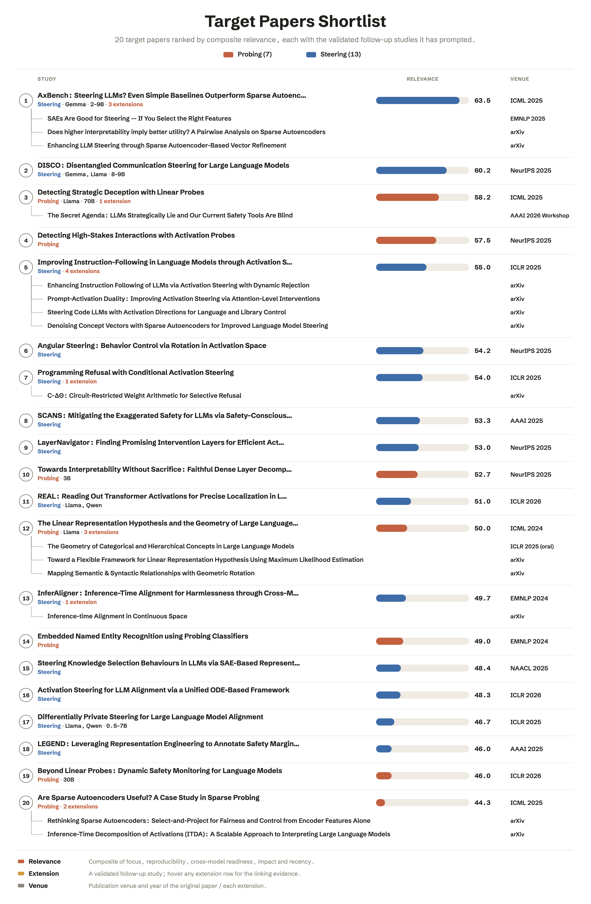

# Generalizable Interpretability — Probes & Steering

_Investigating the generalization of interpretability methods across scenarios and model families at scale — Starting with probing and steering_

<!--   -->

> TL;DR
>
> Most interpretability work are often validated on a **single model**. This project asks which of them actually **generalize**, starting by probing and steering related studies. We build clean, and scalable pipelines that re-runs methods across many model families and sizes, reproducing each candidate paper's original result before testing it elsewhere

Candidate studies are mined from the proceedings of seven major venues and filtered to probing- and steering-relevant work following our inclusion criteria.

      

> The harvest is scored for alignment with the line of attack — \*\*probes first, then
> steering, reusable code, cross-model readiness, and safety or
> alignment relevance — then narrowed to a ranked shortlist.

## Reproduction Shortlist

